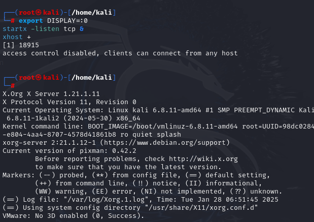
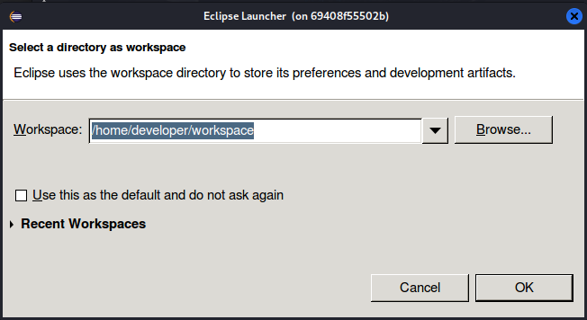

En este enlace vamos a crear un contenedor docker con un entorno IDE Eclipse

Seguiremos las instrucciones y tendremos en cuenta que tenemos que hacer varias operaciones. Las que tienes a continuación son de un entorno Linux:

1. Crear las carpetas necesarias:

~~~
sudo mkdir -p $HOME/docker/eclipse/datos
sudo chown -R $(whoami) $HOME/docker/eclipse
sudo chgrp -R $(whoami) $HOME/docker/eclipse
~~~

    

Antes de continuar, tenemos que tener instalado el Servidor X (Xorg) 
~~~
sudo apt update
sudo apt install xorg xinit
~~~

    

Y también tenemos que tener instalado el packete de docker-compose para poder lanzar el contenedor:
~~~
sudo apt install docker-compose
~~~

    

2. Configurar el entorno gráfico:
~~~
export DISPLAY=:0
startx -listen tcp &
xhost + 
~~~

    

3. Lanzar el contenedor:

~~~
docker run -ti --rm \
  --ulimit nofile=8096:8096 \
  -e DISPLAY=$DISPLAY \
  -e artifactory_host="127.0.0.1:9999" \
  --name eclipse \
  -v /tmp/.X11-unix:/tmp/.X11-unix \
  -v $(pwd):/workspace \
  -v $HOME/docker/eclipse/datos:/home/developer \
  dockeruc/eclipse
~~~
Una vez lanzado el contenedor, se nos abrirá el entorno de desarrollo eclipse en una ventana (adjuntar captura eclipse) y ya tendríamos el entorno eclipse con Docker.

    

