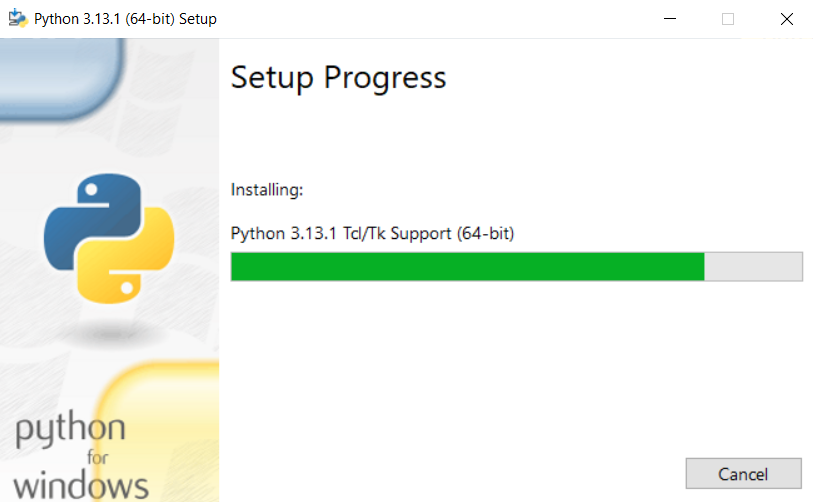
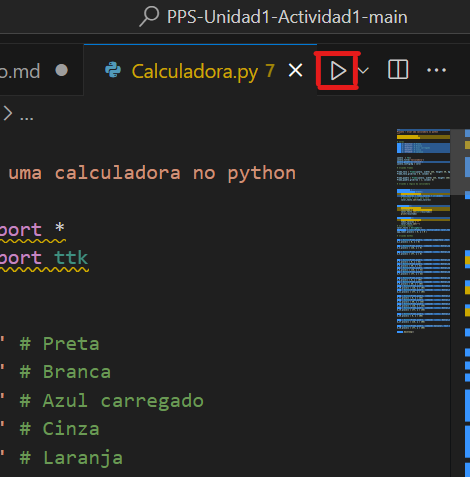
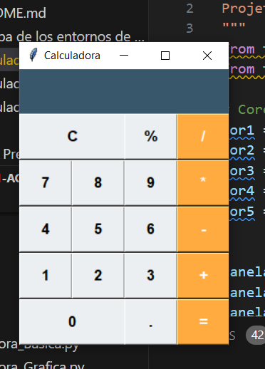
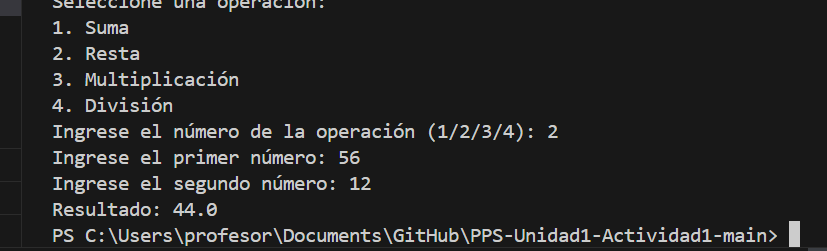
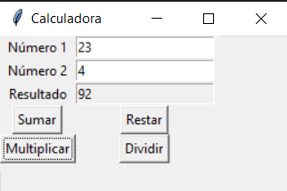

# Prueba de los entornos de desarrollo

El entorno de desarrollo nos sirve para crear nuestras aplicaciones y además podemos comprobar los errores que tienen, problemas de seguridad, etc. por lo que desde allí vamos a poder corregirlos.

Ahora vamos a descargar el código fuente facilitado por el profesor. Crearemos una carpeta llamada *sources* para meter en su interior las fuentes que vayamos usando. Empezamos con un *Calculadora_Basica.py* donde meteremos el código fuente de la calculadora básica en python.
Haremos lo mismo con *Calculadora.py* y *Calculadora_Grafica*.

    

Es importante instalar un intérprete de Python para Windows. Nosotros lo hicimos como se muestra a continuación:

    

Y ahora ya sólo tenemos que compilar y ejecuralo. Para ello tenemos que ir al código que queramos ejecutar y darle al boton de *"play"* tal y como se muestra en la siguiente imagen:

    

Y ya tendríamos la calculadora en modo gráfico para hacer las operaciones correspondientes.
## Calculadora.py 

    

## Calculadora_Basica.py 

    

## Calculadora_Grafica.py 

    

## Conclusion
Probar el código de calculadoras básicas en Python permite garantizar la correcta funcionalidad de las operaciones aritméticas fundamentales, como suma, resta, multiplicación y división. Estas pruebas aseguran que el programa maneje adecuadamente diferentes casos, incluidos valores positivos, negativos, decimales y errores comunes, como divisiones por cero. Además, el proceso fomenta buenas prácticas de programación, como la validación de entradas y el manejo de excepciones, proporcionando una herramienta confiable y eficiente para el usuario final.

